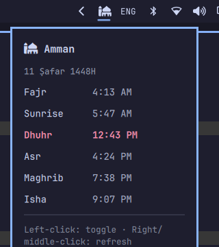

# Prayer times

An [Omarchy](https://omarchy.org/) shell bar widget: a mosque icon that shows
the next prayer and a live countdown on hover, with a click-to-open popup
listing today's five prayer times.

Matches the look of the built-in wifi/sound/keyboard-layout icons — icon
only in the bar, no inline text.



## How it works

- `prayer-fetch.sh` resolves your location the same way the built-in weather
  widget does: reuses `~/.local/state/omarchy/settings/weather.json` if set,
  otherwise IP auto-detects via `omarchy-weather-location`, then geocodes to
  coordinates with Open-Meteo. Prayer times come from the free
  [Aladhan API](https://aladhan.com/prayer-times-api), cached to
  `~/.local/state/omarchy/settings/prayer-times.json` and refreshed once a
  day (or on right/middle click).
- `BarWidget.qml` renders the bar icon (Font Awesome `fa-mosque`) and the
  popup, `Model.js` holds the countdown/formatting logic. Clicking the
  location name in the popup swaps it for a search field (with Open-Meteo
  suggestions) to manually set a location, same as the built-in weather
  widget — and since both share `weather.json`, changing it here moves the
  weather widget's location too.

## Install

```
omarchy plugin add https://github.com/husamemadH/omarchy-prayer-times.git --enable
omarchy bar plugin add local.prayer-times --section right
```

## Configuration

Calculation method defaults to Muslim World League (Aladhan method `3`).
Change it by editing `METHOD` in `prayer-fetch.sh`, or override per-run with
`PRAYER_METHOD=<id>`. See the
[Aladhan docs](https://aladhan.com/calculation-methods) for method IDs.
